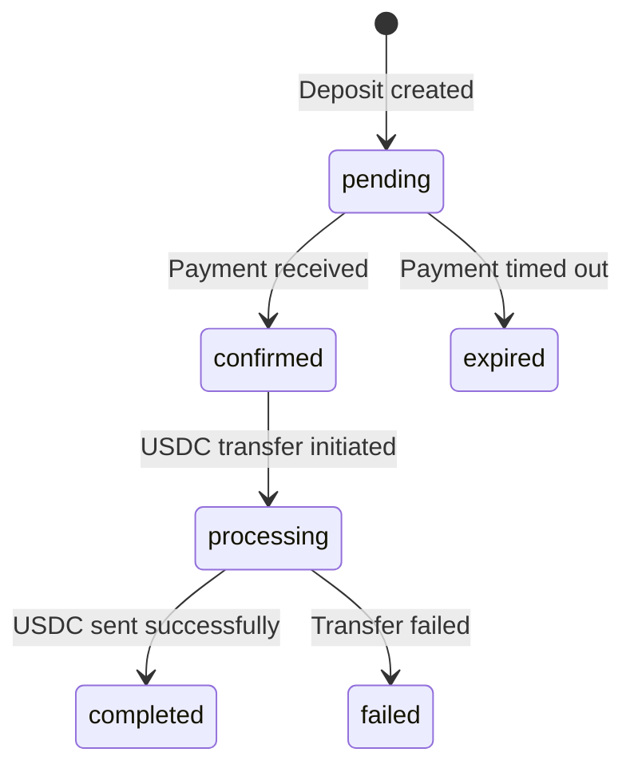

# Deposits

A deposit represents a single conversion from Sierra Leonean Leones (SLE) to USDC on Solana. When a user deposits mobile money, the system automatically converts it to USDC and sends it to their wallet.

## Deposit lifecycle



| Status | Description |
|--------|-------------|
| `pending` | Deposit created, waiting for mobile money payment |
| `confirmed` | Mobile money payment received via webhook |
| `processing` | USDC transfer to Solana in progress |
| `completed` | USDC successfully sent — `solanaTxSignature` available |
| `failed` | USDC transfer failed — check `failureReason` |
| `expired` | Payment window expired (typically 30 minutes for USSD) |

## Payment methods

### USSD (recommended for feature phones)

The API creates a one-time USSD code (e.g., `*715*6908234831#`). The user dials this code from their mobile money registered phone number and confirms the payment.

- Best for: feature phone users, offline scenarios
- Expires after: 30 minutes
- Response field: `ussdCode`

### Checkout (web redirect)

The API creates a hosted checkout session. Redirect the user to the `redirectUrl` where they select their payment method and complete the transaction.

- Best for: smartphone users, web applications
- Requires: `successUrl` and `cancelUrl` in the request
- Response field: `redirectUrl`

## Amount handling

All amounts are in **minor units** (smallest denomination):

| Currency | Minor unit | Example |
|----------|-----------|---------|
| SLE | 1 cent | `50000` = 500.00 SLE |
| USDC | 1/1,000,000 | `20000000` = 20.000000 USDC |

### Conversion formula

```
USDC amount = (SLE amount in minor units / 100) / exchange_rate * 1,000,000
```

Example with rate 25 (25 SLE = 1 USDC):
```
50000 SLE minor units = 500 SLE
500 / 25 = 20 USDC
20 * 1,000,000 = 20,000,000 USDC minor units
```

## Wallet resolution

When creating a deposit, you can either:

1. **Provide a wallet address** — USDC is sent directly to the specified Solana address
2. **Omit the wallet address** — a deterministic wallet is derived from the phone number

Derived wallets always produce the same address for the same phone number, so returning users automatically receive USDC at their previously derived address.

## Idempotency

If a webhook fires multiple times for the same deposit, only the first successful processing takes effect. The system checks the deposit status before initiating any USDC transfer — once a deposit is `completed` or `failed`, subsequent webhook events are ignored.
