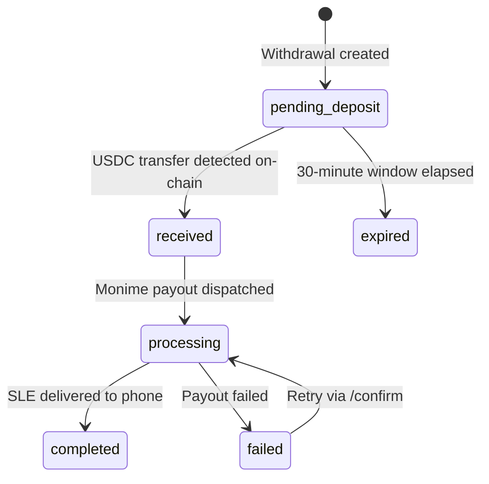

# Withdrawals

A withdrawal is the reverse of a deposit: the user sends USDC from a Solana wallet to the Kola treasury, and the equivalent SLE is paid out to a mobile money account in Sierra Leone.

Unlike deposits — which are push-driven by the mobile money gateway — withdrawals start with the **user pushing USDC on-chain**. Kola detects the incoming transfer (via a Helius webhook) and then triggers the Monime payout.

## Withdrawal lifecycle



| Status | Description |
|--------|-------------|
| `pending_deposit` | Withdrawal created, waiting for USDC to land in the treasury |
| `received` | On-chain USDC transfer verified — Monime payout about to be triggered |
| `processing` | Monime payout dispatched, waiting for the provider to deliver SLE |
| `completed` | SLE successfully paid out — `monimePayoutId` available |
| `failed` | Payout failed — check `failureReason`; the same `solanaTxSignature` may be re-submitted to `/:id/confirm` to retry |
| `expired` | The 30-minute window elapsed before any USDC was received |

## Two ways the withdrawal completes

Both paths run through the same code path and are safe to mix — a per-row compare-and-swap ensures the Monime payout fires exactly once.

### Auto-confirm (recommended)

1. Caller `POST /v1/withdrawals` with `amountUsdc`, `phoneNumber`, `providerCode`, `fromWalletAddress` → receives a `treasuryAddress` and a 30-minute expiry.
2. User signs and sends `amountUsdc` of USDC from `fromWalletAddress` to `treasuryAddress` on Solana.
3. A Helius webhook watching the treasury USDC ATA fires.
4. Kola matches the incoming transfer to an open withdrawal by `(fromWalletAddress, amountUsdc)`, marks it `received`, and triggers the Monime payout.

No second API call is required from the caller. The status page just polls `GET /v1/withdrawals/:id`.

### Manual confirm

If you want to short-circuit waiting on the webhook (e.g. a self-hosted dev environment), call `POST /v1/withdrawals/:id/confirm` with the `solanaTxSignature` after `sendTransaction` resolves. The endpoint re-verifies the tx on-chain before triggering the payout.

The two paths race — the first one to flip `pending_deposit → received` wins, the other becomes a no-op.

## Amount handling

| Currency | Minor unit | Example |
|----------|-----------|---------|
| USDC | 1/1,000,000 | `400000` = 0.40 USDC |
| SLE | 1 cent | `990` = 9.90 SLE |

### Fee + conversion

```
sleMinor = floor(usdcMinor / 1,000,000 * rate * (10000 - feeBps) / 10000 * 100)
```

Example with rate `25` and fee `100` bps (1%):

```
usdcMinor = 400_000           (0.40 USDC)
gross sle = 0.40 * 25 = 10
net sle   = 10 * (1 - 0.01) = 9.90
sleMinor  = 990
```

The exchange rate and fee are locked in at create time and stored on the row.

## Limits

All env-configurable on the API operator side:

| Limit | Default | Env var |
|-------|---------|---------|
| Withdrawal fee | 100 bps (1%) | `WITHDRAWAL_FEE_BPS` |
| Min per tx | 100,000 (0.10 USDC) | `WITHDRAWAL_MIN_USDC` |
| Max per tx | 100,000,000 (100 USDC) | `WITHDRAWAL_MAX_USDC` |
| Daily cap per phone | 500,000,000 (500 USDC) | `WITHDRAWAL_DAILY_CAP_USDC` |

The daily cap is a rolling 24-hour window scoped per phone number, summing all non-`failed`/`expired` withdrawals.

## Provider codes

Only mobile money providers that support outbound payouts are accepted:

| Code | Provider |
|------|----------|
| `m17` | Orange Money |
| `m18` | Africell Money |

QMoney (`m13`) is not supported for outbound payouts in this API version.

## Idempotency

- **`(fromWalletAddress, amountUsdc)` is unique by construction** while a withdrawal is open. `POST /v1/withdrawals` rejects a duplicate pair, keeping the auto-confirm match unambiguous.
- The Monime payout call is fired exactly once per withdrawal. Manual + auto confirms race-safely via a compare-and-swap on the row status.
- A withdrawal in `failed` state with a recorded `solanaTxSignature` and no `monimePayoutId` can be retried by re-submitting the same signature to `/:id/confirm`. On-chain verification is skipped on retry.
